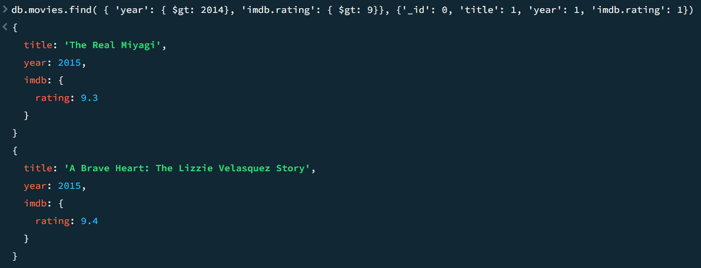

# CS-3980-HW3-MongoDB-Setup-and-Queries

For this assignment, I was required to connect MongoDB atlas to MongoDB compass and run queries in compass. 

for the first query, I had to find all movies with runtime greater than 200 minutes in year 1983. The result should include a list of objects sorted by increasing runtime, and each object only has 3 fields: runtime, title, and year. The appropriate query to achieve this is as follows:

db.movies.find(
  {
    year: 1983,
    runtime: { $gt: 200 }
  },
  {
    _id: 0,
    runtime: 1,
    title: 1,
    year: 1
  }
).sort({ runtime: 1 })

The results from running this query are shown in the screenshot below.

For the second query, I had to find all movies after year 2014 with an imdb rating greater than 9. The appropriate query to achieve this is as follows:

db.movies.find( { 'year': { $gt: 2014}, 'imdb.rating': { $gt: 9}}, {'_id': 0, 'title': 1, 'year': 1, 'imdb.rating': 1})

The results from running this query are shown in the screenshot below.

-----
